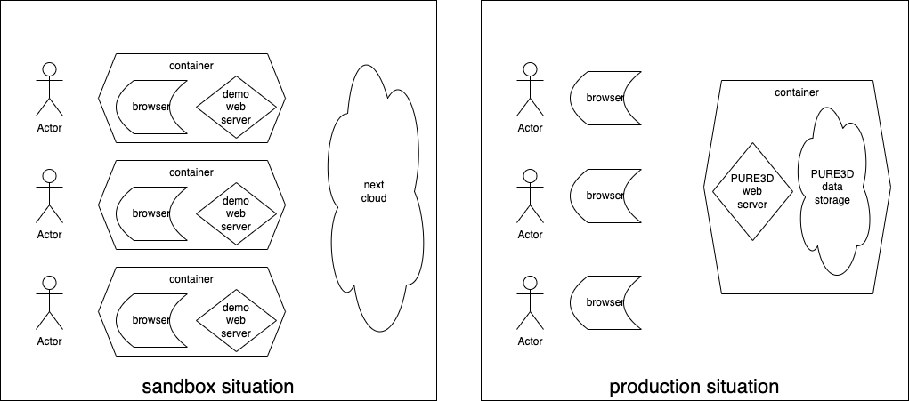

# Move from n sandboxes to 1 webserver

* In the sandbox situation, each user got a separate application in which a voyager demo server was set up.
* In the new situation, there is one server, which serves the voyager viewer to all users.
* currently, the Pure3D data storage is just a mockup of 2 projects with 2 editions each, stored on the webserver's file system

Some key differences

sandbox | webserver
--- | ---
1 user per installed application | the application can serve 1000s of users
authorisation is not implemented and cannot be implemented | authorisation can be implemented in the webserver
additional business logic is not implemented and cannot be implemented | additional business logic can be implemented in the webserver
no embedding of voyager experience in wider context | voyager experience as part of the total experience
# Webserver
The webserver is a Python application that rests on the library *Flask*, which is a skeleton on which we develop custom behaviour.
Sohini will write a lot of code here. See [dip](../../src/dip).
# Webserver + Voyager

* The hard part is to integrate Voyager in the webserver.
* The easy part is to serve the Voyager viewer to the users.
* The difficult part is to support the way the Voyager viewer talks back to the server.
* The only thing the docs say is that it expects the server to be able to handle WebDAV requests.
* We managed to weave the WebDAV protocol into an arbitrary Flask webapp.
* However, we discovered a quirk in the Voyager and proposed a fix, which was accepted.
* For other viewers, the road is expected to be bumpy for the same main reason: lack of specs.
