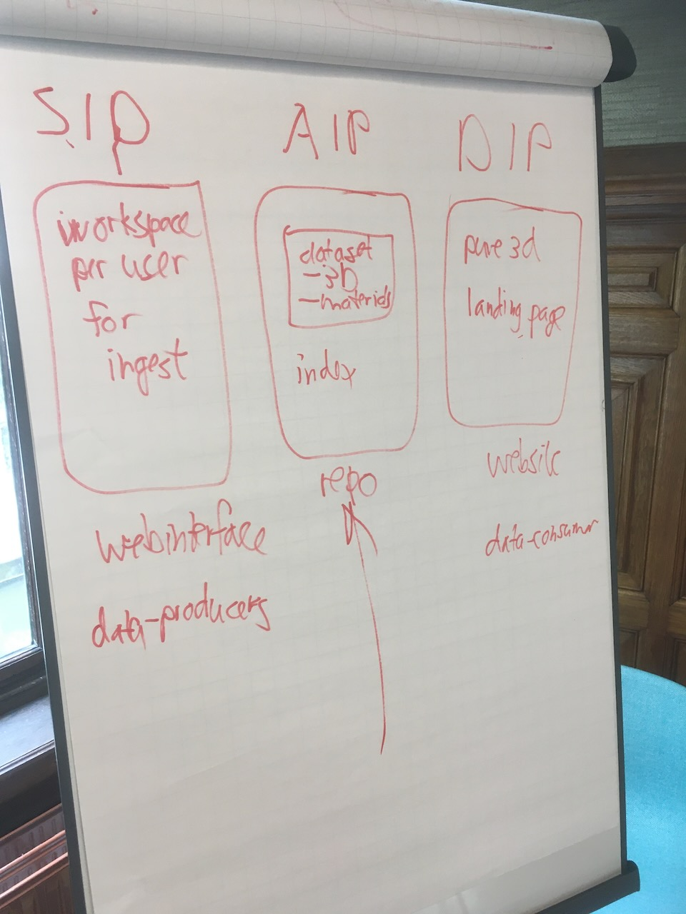

# General Picture

Pure3D is an infrastructure meant to preserve Digital Scholarly Editions of 3D data.

## Archiving

We will be using terms of the [OAIS standard for
archiving](https://www2.archivists.org/groups/standards-committee/open-archival-information-system-oais):
SIP => AIP => DIP, or: Submission => Archiving => Dissemination. The IP stands
for Information Package.

## Editions

A 3D-edition is a 3D model enriched with annotations, articles, tours, overlays
and metadata.  To prevent confusion, we define *editing* as the scholarly
activity of commenting and annotating works of interest. So in this context,
editing a 3D model is adding annotations and articles and tours, and link the
additions to existing geometry in the 3D model. It is not: modifying the
geometry and objects that are in the 3D data. The 3D data will not be touched,
except for sanitising operations, such as changing the resolution, and other
overall transformations that are needed to make the 3D data viewable in current
3D viewers.  The result of editing is a 3D-edition, which can be submitted to
the Pure3D infrastructure, where it becomes archived for the long term, and
from where it can be disseminated to users: the readers of 3D editions.

# [SIP](SIP.md)

*This is about the producers of data, the editors of a scholarly edition.*

A 3D-edition has to be written. How is that done? Currently, there are several
3D-*viewers* that offer users the possibility to add annotations and other
content and link it to the 3D models. Examples are the Smithsonian Voyager and
Virtual Interiors.  However, it is by no means straightforward how edition
writers should set up such a viewer, and communicate their results to an
archive. It is here where Pure3D steps in and offers a standardised
workflow that also allows for collaborative editing.  The concept we need here
is an edition-bound workspace, where writers can upload a 3D model and related
materials, and then view the model in a 3D viewer of choice, and make
annotations. When they save their work, the workspace captures the annotations
that have been made in the viewer, and stores them alongside the 3D model.  The workspace should contain tools to perform sanity checks on the 3D models, and possibly corrective actions too.  When the edition is finished, a publish
action submits the 3D model, the annotations and the related materials as a
single dataset to the archive.

## Implementation note

We intend to build very simple systems for SIP, AIP and DIP initially. These will serve to discover and design all interactions we need between these systems when the users of the infrastructure are doing their work.
Later we might replace these simple systems by full-fledged components built by dedicated open source communities, such as the ones behind [Packrat]([Packrat](https://github.com/Smithsonian/dpo-packrat) and [Archivematica](https://www.archivematica.org/en/) and [Dataverse](https://dataverse.org).

# [AIP](AIP.md)

*This is about archiving a 3D edition, and providing long-term access to it.*

As we have seen above, a 3D edition is eventually represented as a *dataset*
containing a 3D model, related materials, annotations, and metadata.  This can
be archived in standard ways, providing standard services. Here is a short
overview:

* fixity: ensure that the bits of a dataset do not become damaged
* metadata and searching: make the contents of the archive searchable by metadata and full-text
* obsolescence: put mechanisms in place that warn when essential software tools are at the end of their lifetime, especially the 3D viewers that have been used for editing
* harvesting: let other archives harvest metadata
* PIDs: provide persistent identifiers for datasets

## Implementation note

We intend to use a vanilla repository solution. The challenge will be to put the mechanisms in place for handling the articles and annotations that have been added to the 3D data by the edition writers. This will require custom code when we ingest such data and when we disseminate it.

# [DIP](DIP.md)

*This is about the consumers of data, those that read/study a digital edition.*

Users must be able to search/browse the archived editions and their contents, and read those editions. They must be able to view the 3D data in a 3D-viewer, with all the annotations and related materials accessible. More specifications can be found here: 
.

## Implementation note
We intend to write a dedicated web interface for the dissemination part, based on Flask. Possibly index the annotations and related materials in a separate MongoDB database, in order to provide searching on the contents of datasets. 

#architecture 
