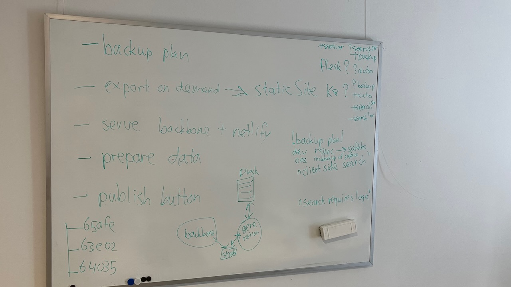

## Conversation Bas, Vic, Dirk

#2023-06-13

We discussed the steps we have to take with Pure3D to turn it into a production system.

There is a short term goal: have a viable demo on #2023-06-21 .

There is a long term goal: have a production system that is properly embedded in the HuC infrastructure.

Meta strategy: the evolution towards a production system will not be driven by ad-hoc deadlines such as demos. When a demo is planned, we just show what we have.

That said: we can oblige Kelly by doing a content and viewer update, and Dirk will pick up content from Kelly, import it in a local pure3D, export it to Bas, who will import it in his static page generator.

# The picture

Currently we have the following ingredients:

* the pure3D app as developed by Dirk, which can be used for admin, authoring and viewing
* the static page generator with proper design by Bas, which can be used for viewing published content.

The question is: how can we integrate both into a viable, comprehensive system?

We arrived at the following components:

* (B=backbone) the pure3D app, in the environment where it is now (but for the move from acceptance to production)
* (P=publication platform Plesk) the system for serving the static site
* (G=Generator) a pod that turns exports from the backbone into static files for Plesk

At the moment we keep things simple (development-wise):
Whenever an edition gets published, the whole site will be regenerated.
Later we can implement incremental site generation, which has the following subtleties:

1. some things in the site are global and will be influenced if a single edition changes: the list of projects, search indexes.
2. deletion of a single edition might be costly.

## Workflow

1. B writes its exports to a share that G can read.
2. G reads the export, generates static pages into a place that P can read. Deletes the export after successful generation.
3. P ingests the files generated by G.

## Search

How do we implement search for the generated site?
We'd rather not have an extra machine dedicated to implement the logic of search and building search indexes next to P. Neither do we want that functionality separate from P, e.g. somewhere near B, because the complete day-to-day functioning of P should be independent of any running code written by us. That way we can sustain the published editions on systems with maximum stability and security at low cost.

How then? We can use LUNR instead of SOLR. LUNR builds the search index in JSON and sends it to the client.
We estimate that even with many published editions, the search index will remain manageable in size.

# Backups

The responsibility for backups is shared between *devs* and *ops*. The *devs* implement a periodic mirroring `rsync` to a safe place. This is the surface backup. 

The safe place is backed up by the *ops*. They make available the backups of the last seven days to *devs*. They preserve the backups of the last 90 days. If *devs* need to access these older backups, they have to ask the *ops*.

# Todos

## Long term

1. (B): implement export-on-demand: a trigger that makes a complete export of published editions to the share where G can read it;
2. (P): set up the serving and refreshing of a static site in Plesk
3. (B): make a `Publish` button with the right business logic for projects
4. (G): make sure that users can select the Voyager version in which they want to see their models
5. (G): maintain the code in a GitHub repository, under `CLARIAH`, not `pure3d` or `pure3dx`, maybe `pure3ds` (static) or `pure3dg` (generator)
6. (B): deploy in a production environment
7. (G) deploy in a production environment
8. (B) (G): adapt the handling of metadata
9. (B) (G): implement search

## Short term

1. Import data, handed over by Kelly, into local Pure3D, export it from there to SURF drive, so it can be used to generate an update of the static site demo of Bas.
	* [ ] #2023-06-15 Kelly hands over data to Dirk
	* [ ] #2023-06-16 Dirk imports data into local Pure3d
	* [ ] #2023-06-19 Bas updates the demo
2. Add Voyager 0.29 to the supported versions in the backbone

